Async betalingsløsning.

## Features
- Aggregater for å lage atomiske transaksjoner mot Oppdrag
- Større meldinger bestående av fler utbetalinger
- Dryrun av operasjonene (simulering)

## Topology
- Dagpenger sender en tykk melding med mange meldeperioder.
- Disse splittes opp i separate utbetalinger og vi utleder en deterministisk uid basert på meldeperioden.
- For å finne ut om utbetalingene er ny, endret, slettet, må vi joine med saker for å finne alle tidligere utbetalinger.
- Aggregatet slår sammen utbetalingene / oppdragene og lager èn oppdrag per sak (forventer bare 1 sak om gangen men fler er støttet).
- Hele oppdraget med alle utbetalingene blir enten OK eller FAILED.
- Status og oppdrag bruker ikke uid som kafka-key men den orginale keyen som kommer fra Topics.dp.
- Dette gjør det enklere for konsumentene å korrelere innsendt request med statuser.
- Til slutt lagrer vi en liste med primary keys på foreign-key topicet som senere brukes til å enten skippe eller persistere utbetalinger (setter de fra pending til aktuell).
- Vi bruker da Oppdraget (requesten) som kafka-key

- Hver gang helved.utbetalinger.v1 blir produsert til akkumulerer vi uids (UtbetalingID) for saken og erstatter aggregatet på helved.saker.v1.
- Dette gjør at vi kan holde på alle aktive uids for en sakid per fagsystem.
- Slettede utbetalinger fjernes fra lista. 
- Hvis lista er tom men ikke null betyr det at det ikke er første utbetaling på sak.

- Vi må vente med å lagre helved.utbetalinger.v1 til vi har fått en positiv kvittering.
- Hvis vi ikke klarer å validere med feil og Oppdrag UR svarer med 08 eller 12,
- så er det fortsatt den forrige utbetalingen som skal gjelde.
- Vi bruker Oppdrag (request) som kafka-key og må derfor fjerne mmel fra Oppdrag (response) for å trigge en join.
- Resultatet av joinen kan ikke være null, da har vi en bug.

