# Peisschtappern

Database-sink for alle våre topics og backend for peisen.

## Features
- Leser alle topics og lagrer de i hver sin tabell
- Tilbyr et REST-API for å gjøre query mot records fra topics.

## Topology
- Leser hver topic med metadata og lagrer i hver sin tabell

