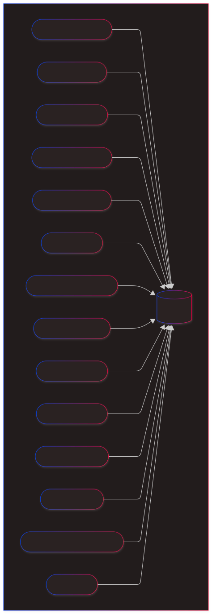

# Peisschtappern

Database-sink for alle våre topics og backend for peisen.

## Features
- Leser alle topics og lagrer de i hver sin tabell
- Tilbyr et REST-API for å gjøre query mot records fra topics.

## Topology
- Leser hver topic med metadata og lagrer i hver sin tabell




## Audit-logger (GCP)
`GET /api/audit-logs?filter=&pageSize=&pageToken=` leser fra log-viewet i `AUDIT_LOG_VIEW`
(prod: `projects/helved-prod-119e/locations/europe-north1/buckets/TeamAudit/views/_AllLogs`).
Autentisering skjer via Workload Identity. Appens GSA må ha `roles/logging.viewAccessor` på viewet (engangsoppsett):

// TODO: Usikker på om dette er ritkig måte å løse det på..
```sh
# NAIS-GSA ligger i cluster-prosjektet (nais-prod-020f), ikke i helved-prod-119e.
# Finn den via eksisterende cloudsql-binding:
#   gcloud projects get-iam-policy helved-prod-119e --format=json | grep peiss
GSA=peisschtapp-helved-uhcyj3y@nais-prod-020f.iam.gserviceaccount.com
gcloud logging views add-iam-policy-binding _AllLogs \
  --bucket=TeamAudit --location=europe-north1 --project=helved-prod-119e \
  --member="serviceAccount:$GSA" --role=roles/logging.viewAccessor
```
