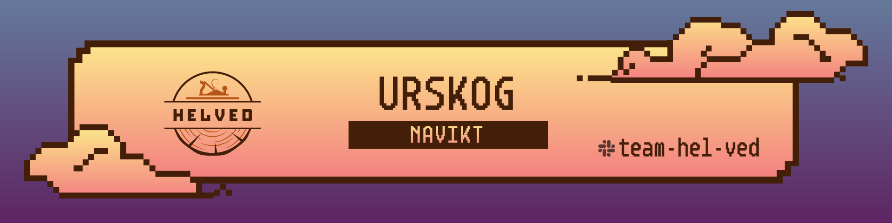

I urskogen finner man kulturarv fra oldtiden.

## Features
- Propagerer simuleringer fra Kafka til REST-clienten vår (helved-simulering)
- Propagerer avstemminger fra Kafka til MQ
- Propagerer oppdrag fra Kafka til MQ
- Propagerer kvitteringer fra MQ til Kafka 
- Tolker kvitteringene og oppretter statusmeldinger på Kafka 

## Topologies

- Oppdrag lagres i en keystore med nøkler vi klarer å slå opp på igjen
- Kvitteringer lagres i en state store med det samme settet av fremmed-nøkler
- Disse to state-storene joines - og sender en event når begge sidene har data, dette er pga race-condition - at begge sider kan komme før den andre
- Når join er utført, overskrives oppdraget på helved.oppdrag.v1 med mmel (kvitterings-feltet)
- Status utledes og legges på "helved.status.v1" (200, 400 eller 500 type status)

- Leser helved.simulering.v1 og sender request via proxy til gandalf og os/ur
- Svarene mappes til ulike formater og legges på fagsystemene sine respektive topics, pga sensitiv informasjon
- Status returneres ved bad-request, eller ved feil mot OS/UR, gandalf, proxy etc.

- Avstemminger opprettes i vedskiva, ved å se på alle oppdrag/kvitteringer.
- Disse blir splittet opp i en start/data/slutt melding per fagsystem.
- Avstemmingene på topic blir propagert rett fra topic til MQ.

