En rest-basert fasade for utbetalinger.

## Features
- Atomiske utbetalinger uten kjeding via `/utbetalinger/{uid}`
- Simulering uten kjeding via `/utbetlainger/{uid}/simuler`
- Utbetalinger med kjeding via `/api/iverksetting/v2`
- Simulering med kjeding via `/api/simulering/v2`

## Topology
- Utbetalinger kommer inn via REST-APIet
- Disse blir lagret i databasen samtidig som de utledes til Oppdrag som legges på helved.oppdrag.v1
- Status om oppdraget leses fra helved.status.v1 og lagres i databasen
- REST-APIet brukes for å polle på denne statusen 

