# Vedskiva

Scheduler for (grensesnitt)avstemming.
Avstemminger kjøres hver virkedag og avstemmer alle oppdrag og kvitteringer siden forrige virkedag.

## Features
- Lagrer dato for gjennomført avstemming i database
- Kjøres som en kubernetes (cron) job hver dag men gjør ingen ting på helligdager

## Topology
- På virkedag hentes forrige gjennomførte avstemmingsdato og henter oppdrag fra Peisschtappern
- Avstemminger kalkuleres og legges på helved.avstemming.v1

