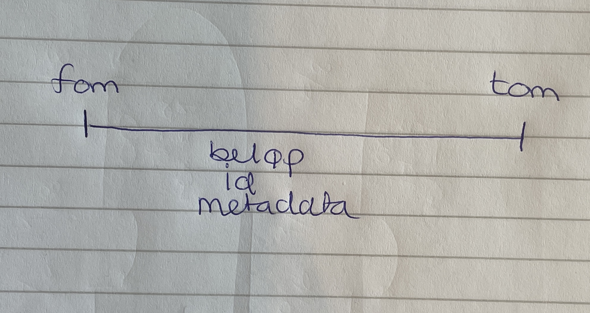
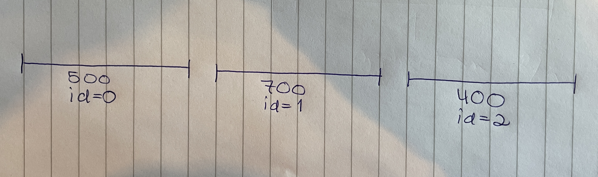
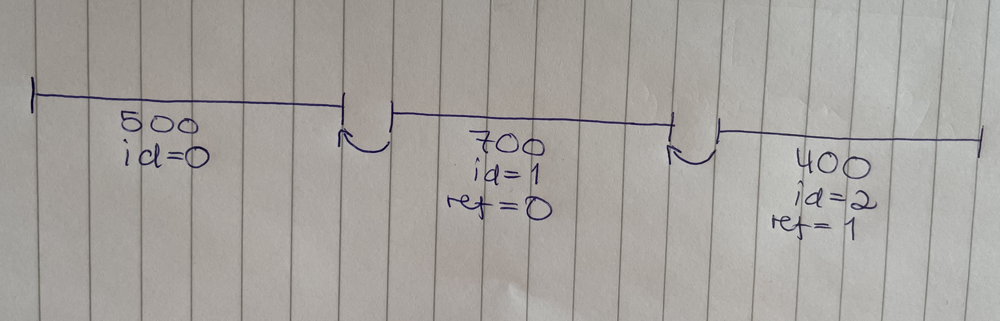
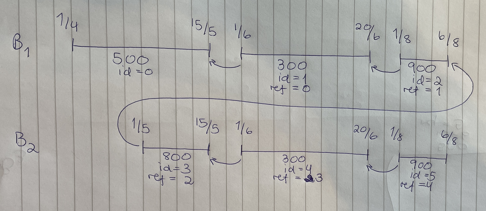
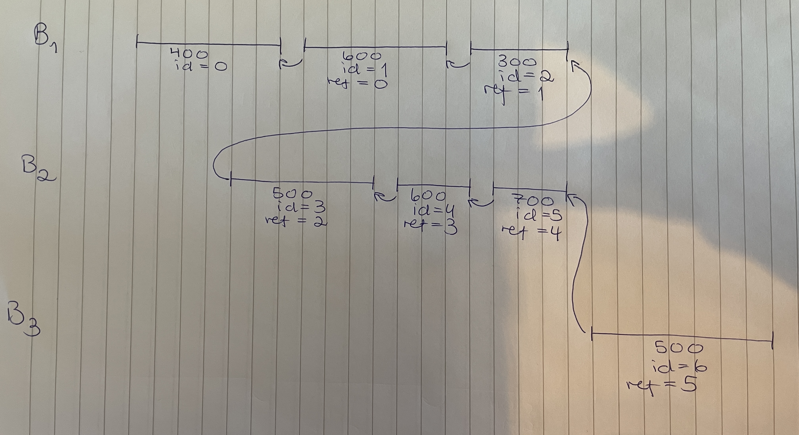

# Kjeding av utbetalingsperioder

## Utbetalingsperioder
Den minste enheten vi jobber med innenfor økonomidomenet er en utbetalingsperiode. Den har en id, en fom-dato og en tom-dato, et beløp og en del metadata knyttet til seg. 
En utbetalingsperiode er det samme som en oppdragslinje i OS. Når vi sender en utbetalingsperiode til OS, vil OS beregne totalbeløpet for perioden og betale det ut til bruker.
Alle utbetalingsperioder må ha en unik id.

Ofte har man behov for å dele opp en utbetaling i flere utbetalingsperioder. Dette kan skje enten fordi beløpet endrer seg eller fordi man har ulik metadata for ulike deler av
den totale perioden man skal utbetale for. Dette er illustrert nedenfor. Man får også gjerne flere utbetalingsperioder innenfor samme sak der periodene er fordelt på flere behandlinger/vedtak. 

## Kjeding
Kjeding er en funksjonalitet i OS som går ut på at man kobler sammen ulike utbetalingsperioder innenfor samme sak. Utbetalingsperiodene som man kobler sammen fungerer som en slags tidslinje,
og det kan kun være én gjeldende utbetalingsperiode på et gitt tidspunkt innenfor samme kjede. Kjeding er en funksjonalitet som man står helt fritt til å velge å bruke eller ikke bruke, men
de fleste moderne vedtaksløsninger har valgt å ta i bruk kjeding (blant annet sykepenger, foreldrepenger, etterlatte, barnetrygd). Rent teknisk kommuniserer man kjeden til OS vha et referanse-felt
på oppdragslinja som refererer tilbake til id-en for forrige oppdragslinja på kjeden. Dette er illustrert under.

Det største insentivet for å bruke kjedingsfunksjonaliteten er at det gjør korrigering av utbetalingsperioder lettere. Fordi det kun kan være én gjeldende utbetalingsperiode på et gitt tidspunkt i kjeden,
kan man lage nye utbetalingsperioder som overskriver eksisterende utbetalingsperioder når man vil gjøre en korrigering. Det er viktig å vite at når man legger til en ny periode på en kjede, vil den nye perioden 
overskrive _hele_ kjeden fra og med tidspunktet perioden starter. Det betyr at alle utbetalingsperioder og deler av utbetalingsperioder etter endringstidspunktet vil opphøres med mindre man eksplisitt overskriver dem
med nye, identiske perioder. Dette er illustrert i figuren under, der man i behandling 2 vil øke beløpet for mai fra 500 kr til 800 kr. Hvis man kun hadde sendt den nye perioden for mai i behandling 2,
ville utbetalingsperiodene for juni og august blitt opphørt. Derfor må de sendes på nytt i behandling 2 med identisk beløp, og så vil OS beregne at det ikke er noen endring for disse periodene.

## Hvilke utbetalingsperioder bør kjedes sammen? 
Siden kjeding brukes for å gjøre korrigering enklere, er det stort sett alltid smart å beholde kjedene på tvers av behandlinger/vedtak innenfor samme sak. Hvis vedtaksløsningen da gjør en revurderingsbehandling på en sak,
kan Utsjekk legge til nye perioder på eksisterende kjede for å overskrive utbetalingsperioden(e) som ble iverksatt i førstegangsbehandlingen. Dette er illustrert nedenfor, der behandling 1 har tre utbetalingsperioder
i kjeden, behandling 2 gjør en korrigering av beløp og fortsetter den samme kjeden, og behandling 3 har en ny utbetalingsperiode som ikke overskriver eksisterende perioder på kjeden.

Det varierer fra ytelse til ytelse hva som gir mening å kjede sammen. Mange ytelser kan ha flere utbetalingsperioder samtidig fordi de må dele opp utbetalingen i ulike klassifiseringskoder. 
Dette gjelder for eksempel tiltakspenger, som har separate klassifiseringskoder for barnetillegg. De vil sende minst én utbetalingsperiode for den vanlige utbetalingen og én utbetalingsperiode
for barnetillegget når de iverksetter utbetaling for et meldekort til en bruker med barn. Hvis barnetillegget og den vanlige utbetalingen hadde vært koblet sammen på én kjede, ville den ene perioden overskrevet den andre,
og totalbeløpet som betales ut til bruker ville blitt feil. På grunn av dette er det vanlig å anbefale at hver klassifiseringskode får sin egen kjede. 

Det er også fint å ha tenkt gjennom hvor lange kjeder man ønsker å ha for en gitt ytelse. Her vil behovene variere med hvordan sak, behandling og vedtak modelleres i den enkelte vedtaksløsningen, samt ytelsens natur mtp. hva
som korrigeres og hvor ofte, og hvor mange utbetalingsperioder hver sak har. Noen vedtaksteam har valgt å kjede sammen alle utbetalingsperioder for en gitt sak og klassifiseringskode.
Da kan de, hvis saken er langtlevende, ende opp med kjeder som spenner over veldig lang tid. Konsekvensen av dette er at man må sende mange eksisterende utbetalingsperioder på nytt til OS 
dersom man vil korrigere en periode som er langt tilbake i tid. 

For meldepliktsytelser ønsker PO Utbetaling at vi kjeder sammen alle perioder som hører til samme meldekort, men ikke kjeder på tvers av flere meldekort. Da vil vi få korte kjeder som aldri spenner over mer enn 14 dager.
Det betyr at hvis vedtaksløsningen vil korrigere et meldekort, trenger vi bare å sende periodene for meldekortet som korrigeres på nytt til OS uavhengig av hvor gammelt meldekortet er og hvor mange andre meldekort
brukeren har sendt inn i ettertid. Hvis vedtaksløsningen bruker en modell der en enkelt revurdering kan gjelde mange meldekort, må vi regne med å måtte korrigere/skrive over mange kjeder i samme iverksetting.
